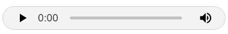
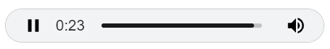
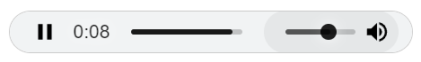
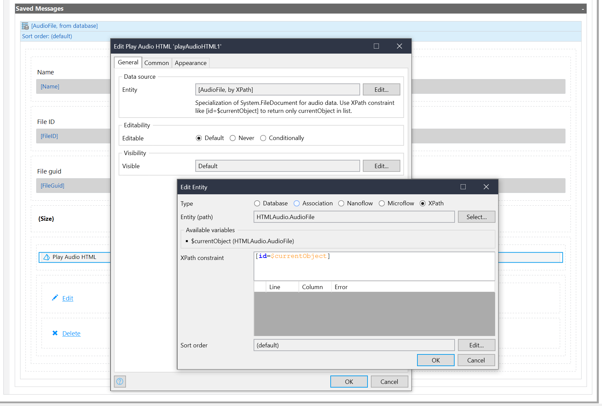

## PlayAudioHTML
A Mendix widget that plays common audio files in a browser stored in an 
object (entity) that is a specialization of [System.FileDocument](https://docs.mendix.com/howto8/data-models/working-with-images-and-files/). 
It displays controls for play, pause, volume, etc.

Different browsers play different media types. WAV, MP3, and MP4 containers 
are widely supported (PCM, MP3, and AAC formats, respectively). Other 
containers like ADTS, Ogg, WebM, and FLAC may be supported (AAC, Vorbis, 
Opus, and FLAC formats). See [HTML5 Audio - Supported audio coding formats](https://en.wikipedia.org/wiki/HTML5_audio#Supported_audio_coding_formats) 
for browser support.

## Features
This uses the [HTML5 
\<audio>](https://developer.mozilla.org/en-US/docs/Web/HTML/Element/audio) 
element and displays time elapsed / total time and a moving playhead with 
controls for play/pause, etc.

#### Ready to play audio file

#### Audio file is playing

#### Adjust volume while audio file is playing

## How to Use in a Studio Pro Project

1. Add a Data View or List View of a specialization of the System.FileDocument 
entity to a page.
2. In the Data View, add a Play Audio HTML widget.
3. In the Play Audio HTML widget properties under Data source, set Entity 
to the entity that is a specialization of System.FileDocument that has the 
audio data. This retrieves a list of objects.
4. Use an [XPath constraint](https://docs.mendix.com/refguide/xpath-keywords-and-system-variables/) 
like [id=$currentObject] to limit the list to just the currentObject. This 
is a workaround because the Mendix client API in version 9 for a [datasource](https://docs.mendix.com/apidocs-mxsdk/apidocs/pluggable-widgets-property-types-9/#datasource) 
returns a [ListValue](https://docs.mendix.com/apidocs-mxsdk/apidocs/pluggable-widgets-client-apis-list-values/#listvalue) 
which is a list of ObjectItem (not [MxObject](https://apidocs.rnd.mendix.com/9/client/mendix_lib_MxObject.html) 
which would be convenient). The ObjectItem.id is the guid of the object.

See descriptions of how to use ObjectItem with examples here:

[Client APIs for Pluggable Widgets, section 4.4 ModifiableValue](https://docs.mendix.com/apidocs-mxsdk/apidocs/pluggable-widgets-client-apis/#modifiable-value)

[Client APIs for Pluggable Widgets, section 3.1 ListActionValue](https://docs.mendix.com/apidocs-mxsdk/apidocs/pluggable-widgets-client-apis-list-values/#listactionvalue)

[Client APIs for Pluggable Widgets, section 3.4 ListWidgetValue](https://docs.mendix.com/apidocs-mxsdk/apidocs/pluggable-widgets-client-apis-list-values/#listwidgetvalue)

The widget will display on the page and allow you to play the audio file, 
unless it returns more than one object because it hasn't been constrained 
with XPath to just the currentObject.

## How to Build

1. Clone this code.
2. Run `npm install` in the root project directory to install dependencies 
(to the `node_modules` directory which gets created).
3. (_optional_) To automatically copy the compiled widget .mpk file to the 
widgets directory in a Mendix project, modify the `projectPath` under 
`config` in package.json with the root directory of the Mendix project; 
for example: `"projectPath": "C:\\Users\\MyUser\\Documents\\Mendix\\HTML Audio-test-app"`.
4. Run `npm run build` to compile the code and create the widget .mpk 
file under the `dist` directory (and copy it to the Mendix project's 
`widgets` directory if `projectPath` was set).

## Development and contribution

1. Install NPM package dependencies by using: `npm install`. If you use NPM v7.x.x, which can be checked by executing `npm -v`, execute: `npm install --legacy-peer-deps`.
1. Run `npm start` to watch for code changes. On every change:
    - the widget will be bundled;
    - the bundle will be included in a `dist` folder in the root directory of the project;
    - the bundle will be included in the `deployment` and `widgets` folder of the Mendix test project.

[specify contribution]
